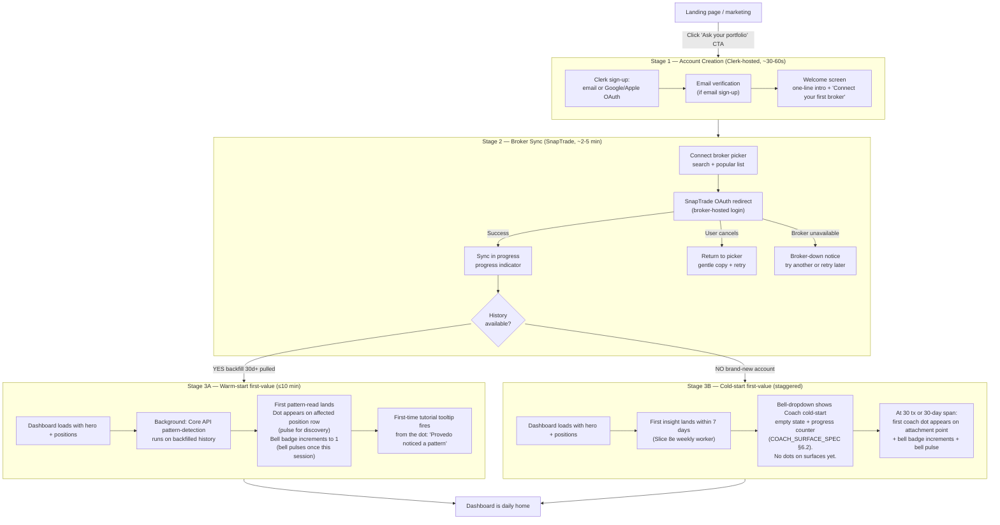

# Onboarding Flow — Provedo

**Owner:** product-designer
**Status:** draft v1.1 — Stage 3 first-value moment updated to contextual-icon + bell-dropdown model per Coach UX PO lock 2026-04-23
**Date:** 2026-04-23
**Scope:** 3-stage onboarding. Stage 1 account creation (Clerk). Stage 2 broker sync (SnapTrade). Stage 3 first-value moment (warm-start ≤10 min via backfill-derived pattern-read that lands as dot + bell-badge; cold-start dual path with bell-dropdown empty state).
**Depends on:** `docs/04_DESIGN_BRIEF.md` v1.3; `docs/design/DASHBOARD_ARCHITECTURE.md` v1.1; `docs/design/COACH_SURFACE_SPEC.md` v2.0 §6 empty states + §7 bell-dropdown; `docs/CC_KICKOFF_option4_coach_adr.md` §2.3 soft gate; `docs/product/02_POSITIONING.md` v3.1 §«Onboarding promise»; `docs/DECISIONS.md` entry 2026-04-23 «Coach UX: contextual — NOT dedicated route, NOT filter-chip».

---

## 1. Flow overview



**Key design principle:** onboarding ends at Stage 1+2 completion. Stage 3 is **background progress**, not a blocking step. User sees dashboard immediately after broker sync; first-value artifacts appear as notifications + surface-state changes.

**Target drop-off mitigation:**
- Stage 1 → Stage 2: <10% drop (Clerk OAuth one-click reduces friction).
- Stage 2 → sync success: <20% drop (mitigated via progress indicator + honest error states).
- Stage 3A warm-start: should hit ≥80% of users (SnapTrade backfills 30d+ for majority of brokers).
- Stage 3B cold-start: separate activation metric (day-7 return rate); coach cold-start empty state is the anti-churn anchor.

---

## 2. Stage 1 — Account creation

### 2.1 Entry point

User arrives from landing page CTA «Ask your portfolio» / «Спроси свой портфель» → `/sign-up` (Clerk-hosted, already shipped per `apps/web/src/app/(auth)/sign-up/`).

### 2.2 Screens

**Screen 1.1 — Clerk sign-up**

```
┌─────────────────────────────────────────────────────┐
│               Provedo                                │
│                                                     │
│          Second Brain for Your Portfolio            │
│                                                     │
│   ┌───────────────────────────────────────┐         │
│   │ [G] Continue with Google              │         │
│   └───────────────────────────────────────┘         │
│   ┌───────────────────────────────────────┐         │
│   │ [🍎] Continue with Apple              │         │
│   └───────────────────────────────────────┘         │
│                                                     │
│              — or —                                 │
│                                                     │
│   ┌───────────────────────────────────────┐         │
│   │ Email                                 │         │
│   └───────────────────────────────────────┘         │
│   ┌───────────────────────────────────────┐         │
│   │ Password                              │         │
│   └───────────────────────────────────────┘         │
│                                                     │
│   [  Continue  ]                                    │
│                                                     │
│   By signing up you agree to our Terms and          │
│   Privacy Policy.                                   │
└─────────────────────────────────────────────────────┘
```

**Design notes:**
- Provedo wordmark at top. Below: tagline (smaller, `text.secondary`). Establishes product identity before any form field.
- OAuth options are prioritized (top). Email sign-up is secondary.
- No «Why sign up?» copy on this screen — landing already covered it. Don't repeat; get user through the form.
- Clerk's default theme is over-ridden via design-tokens (see Design Brief §17.1). No «dark-vs-light flash» on navigation; use tokens consistently.
- Footer: Terms + Privacy Policy links inline, not buried. Required for regulatory compliance (GDPR, CCPA).

**Drop-off mitigation at Screen 1.1:**
- OAuth first reduces friction for users averse to password creation.
- «Continue» copy (not «Sign up» or «Create account») — lower-commitment language.
- No captcha on sign-up for alpha (rely on Clerk's built-in rate-limiting + bot detection). Add captcha if abuse observed post-alpha. Per Design Brief §13.3 — no unnecessary friction.

**Screen 1.2 — Email verification (conditional, email sign-up only)**

```
┌─────────────────────────────────────────────────────┐
│                                                     │
│         Check your inbox                            │
│                                                     │
│   We sent a 6-digit code to user@example.com.       │
│   It expires in 10 minutes.                         │
│                                                     │
│   ┌───┬───┬───┬───┬───┬───┐                        │
│   │ 1 │ 2 │ 3 │ 4 │ 5 │ 6 │                        │
│   └───┴───┴───┴───┴───┴───┘                        │
│                                                     │
│   [  Verify  ]                                      │
│                                                     │
│   Didn't get it?  Resend (in 30s)                   │
│   Wrong email?    Change email                      │
└─────────────────────────────────────────────────────┘
```

**Design notes:**
- 6-digit code inputs with auto-advance + paste support.
- Resend disabled for 30s (prevent spam); countdown visible.
- «Change email» option to correct typos without restarting.
- OAuth sign-ups skip this screen entirely.

**Screen 1.3 — Welcome (one screen, no onboarding carousel)**

```
┌─────────────────────────────────────────────────────┐
│                                                     │
│            Welcome to Provedo, [name]                │
│                                                     │
│   Provedo remembers what you hold, notices what      │
│   you'd miss, and explains what it sees.            │
│                                                     │
│   Let's connect your first broker to get started.   │
│                                                     │
│   [  Connect a broker  ▸  ]                         │
│                                                     │
│   You can add more brokers later.                   │
└─────────────────────────────────────────────────────┘
```

**Design notes:**
- **No onboarding carousel.** «Walk users through features» patterns have low engagement and delay time-to-value. Provedo's value is demonstrated by seeing their own portfolio, not by reading product descriptions. Let them connect and see.
- The 3-verb tagline («remembers, notices, explains») is our onboarding promise, compressed. Aligns with landing hero sub.
- Primary CTA is one action: «Connect a broker». No secondary «skip for now» — without a broker, Provedo has nothing to show. If we offer skip, users land on empty dashboard and churn.
- «You can add more brokers later» — honest expectation management; reduces anxiety about which to pick first.

**Copy hooks (content-lead to finalize):**
- Greeting: «Welcome to Provedo, [name]» (Clerk provides first-name).
- Intro: one line using verbs from positioning («remembers, notices, explains»).
- Transition: «Let's connect your first broker to get started.»
- CTA: «Connect a broker» (imperative, action-forward).
- Microcopy: «You can add more brokers later.»

**Drop-off mitigation at Screen 1.3:**
- Show this screen ONLY once per user. On return, user lands on dashboard (with appropriate empty state if no broker connected).
- If user bounces from Screen 1.3 without connecting: 24h-later email nudge with «Pick up where you left off» → routes back to `/onboarding/connect`.

---

## 3. Stage 2 — Broker sync (SnapTrade)

### 3.1 Entry point

User clicks «Connect a broker» on Screen 1.3 (or later from dashboard empty state or `/settings/accounts`). Routes to `/onboarding/connect`.

### 3.2 Screens

**Screen 2.1 — Broker picker**

```
┌─────────────────────────────────────────────────────┐
│ ←  Connect a broker                                 │
├─────────────────────────────────────────────────────┤
│                                                     │
│   Pick your broker                                  │
│                                                     │
│   ┌─────────────────────────────────────────────┐   │
│   │ 🔍 Search brokers...                        │   │
│   └─────────────────────────────────────────────┘   │
│                                                     │
│   Popular                                           │
│   ┌──────┬──────┬──────┬──────┐                    │
│   │  🏦   │  🏦   │  🏦   │  🏦   │                    │
│   │ Fide- │ Schwab│ IBKR  │ Robin-│                  │
│   │ lity  │       │       │ hood  │                  │
│   └──────┴──────┴──────┴──────┘                    │
│   ┌──────┬──────┬──────┬──────┐                    │
│   │  🏦   │  🏦   │  🏦   │  🏦   │                    │
│   │ E*TRA-│ Trad- │ Ques- │ Coin- │                  │
│   │ DE    │ ing212│ trade │ base  │                  │
│   └──────┴──────┴──────┴──────┘                    │
│                                                     │
│   See all 1000+ brokers ▸                           │
│                                                     │
│   ───                                               │
│                                                     │
│   Read-only connection. Provedo never places         │
│   trades or moves money.                            │
└─────────────────────────────────────────────────────┘
```

**Design notes:**
- Grid of 8 popular brokers by geo (US = Fidelity / Schwab / IBKR / Robinhood / E*TRADE; EU = Trading212 / HL / Degiro; crypto = Coinbase / Binance / Kraken). Detection by IP + user locale; fallback to US default.
- Search bar at top for long-tail (SnapTrade supports 1000+ brokers).
- **Trust marker at bottom:** «Read-only connection. Provedo never places trades or moves money.» — explicit, not hidden in tooltip. This addresses the most common abandonment reason («they want my broker password?!»).
- Broker tiles are square, logo-centric, use the broker's actual logo (licensed from SnapTrade assets).
- Tile hover: `border.subtle → border.default` + minor lift (shadow-sm → shadow-md). Click: route to SnapTrade OAuth flow.

**Screen 2.2 — SnapTrade OAuth redirect**

User leaves Provedo for broker's OAuth page. This is SnapTrade-hosted / broker-hosted; we don't control UI. **Design contract with SnapTrade integration:**

- Return URL: `/onboarding/connect/return?status={success|cancel|error}`.
- On success: fetch SnapTrade user + accounts + initial holdings. Sync job queued.
- On cancel: gentle return to picker (Screen 2.1) with preserved search state; copy «No worries — try another or come back later».
- On broker-side error: return to picker with error notice «This broker's connection is having issues. Try again in a few minutes, or connect a different broker.»

**Screen 2.3 — Sync in progress**

```
┌─────────────────────────────────────────────────────┐
│                                                     │
│      Provedo is reading your Fidelity account        │
│                                                     │
│   ┌──────────────────────────────────────┐         │
│   │ ████████░░░░░░░░░░░░  42%            │         │
│   └──────────────────────────────────────┘         │
│                                                     │
│   Fetching positions... (done)                      │
│   Fetching transaction history... (in progress)     │
│   Reading patterns... (queued)                      │
│                                                     │
│   This takes 2–5 minutes for most brokers.          │
│   You can close this page — we'll notify you        │
│   when your dashboard is ready.                     │
│                                                     │
│   [  Close and wait  ]                              │
└─────────────────────────────────────────────────────┘
```

**Design notes:**
- Progress stages are visible and honest. Users can see WHERE in the process their sync is, not just a spinner.
- «You can close this page — we'll notify you» is a promise: when sync completes, an email + in-app Bell notification fires. Respects user's time.
- Progress bar indeterminate shimmer if no percentage from SnapTrade; determinate if API returns progress.
- On close: user lands on dashboard with a «Syncing…» banner at top. Banner auto-dismisses when sync completes.

**Screen 2.4 — Sync error states**

Three named error states with distinct copy:

| Error | Copy | CTA |
|---|---|---|
| Broker temporarily unavailable | «Fidelity's connection is having issues right now. This usually resolves within a few minutes.» | `Try again` + `Connect a different broker` |
| User cancelled broker OAuth | «No worries — you can come back and connect anytime.» | `Pick a broker` + `Skip for now` |
| Authorization expired | «Your connection expired. Re-authorize Fidelity to resume syncing.» | `Re-authorize` |
| Unknown error | «Something went wrong syncing Fidelity. We logged it; our team can help.» | `Try again` + `Contact support` |

Per Design Brief §2.2, error tone is calm + specific + next step.

---

## 4. Stage 3 — First-value moment

**Critical design decision:** Stage 3 does NOT wait for calendar day-30. It triggers on backfill-derived pattern-read whenever possible (target: ≤10 minutes post-Stage-2 completion).

### 4.1 Two paths (per tech-lead ADR 5)

**Path A — Warm-start (backfill available).** SnapTrade returns ≥30 transactions OR ≥30-day transaction span. Core API pattern-detection runs on backfilled history. First pattern-read generated within ~10 minutes of sync completion.

**Path B — Cold-start (no backfill).** Brand-new brokerage account, or broker returns no history. User waits for organic accumulation to reach soft-gate threshold (`tx_count >= 30 OR span >= 30 days`).

### 4.2 Path A — warm-start timeline

```
T+0:00  Stage 2 sync completes. Dashboard loads with:
         - Hero: total value + today's delta (if intraday data available)
         - Positions table populated
         - «Provedo is reading your history» banner at top
         - Bell icon visible in top-bar (badge = 0, no dots yet)

T+0:30  Background: Core API pattern-detection queued on user's
         backfilled transactions (tech-lead Slice 8a foundation).

T+2-10  First pattern-read(s) complete. AI Service narrative
         generation runs. Regex guardrail validates.

T+10    Insights-table row inserted with type `coach_weekly`.
         First-value moment primitives fire:
         - Dot appears on affected position row (or widget header /
           chat thread / insight card / tx row per attachment
           mapping). Dot pulses (1200ms scale cycle, every 2.5s,
           bounded 5min or until user hovers/taps).
         - Bell badge increments to N (1 or more, depending on
           how many patterns detected from backfill).
         - Bell icon gains violet-700 outer ring (coach-unread
           differentiator, §14.7 Design Brief v1.3).
         - Bell itself pulses ONCE (same 1200ms scale) — marks
           first-coach-of-session. Subsequent patterns in the
           session increment silently.
         - Dismissable dashboard banner: «Provedo read your
           history — N patterns noticed. Check the bell ↑.»
         - If user's first interaction is with the dot: the
           first-time tutorial tooltip fires (COACH_SURFACE_SPEC
           §3.5) explaining the convention.
         - If user's first interaction is with the bell: the
           first-time bell tooltip fires (COACH_SURFACE_SPEC §7.5).
         Tutorial flag persists per user; fires once across both paths.
```

**Design contract:**
- The banner is modal-free. User can dismiss it or click through. Dismissal doesn't cancel the dot or the bell-badge — only the banner.
- Dots and bell are the load-bearing first-value signals. Banner is a secondary human-readable announcement.
- If warm-start pattern-detection takes >30 minutes, banner escalates: «Still reading your history — a bit slower today. We'll notify you as soon as patterns land.» Bell-dropdown continues to show Path A empty state (§6.1 of Coach spec).
- If warm-start produces zero patterns (rare — user has imported-but-bland history): banner becomes «Provedo read your history — no patterns flagged this week. That's a good sign. Check back next Sunday for your first weekly read.» Bell-dropdown moves to post-gate quiet state (§6.3 of Coach spec).
- **Reduced motion:** dot pulse + bell pulse disabled. Banner appears without slide-in animation.

### 4.3 Path B — cold-start timeline

```
T+0:00    Stage 2 sync completes. Dashboard loads with:
           - Hero: total value + today's delta
           - Positions table populated
           - «Welcome! Provedo's starting to learn your portfolio.»
             dismissable banner
           - Bell icon visible; badge = 0; no coach-unread ring.
             Opening bell shows Path B cold-start empty state
             (COACH_SURFACE_SPEC §6.2) with day/tx progress counter.

T+0-7d    First insight-of-the-week lands when ≥1 insight
          generator rule fires (e.g., «NVDA is 14% of your portfolio»
          can fire immediately from positions state).
          Target: first insight within 7 days; most users see one
          within first session due to static rules.
          Insight appears in /insights feed + on dashboard top card.
          No Coach dot yet (coach gate not crossed).

T+0-30d   Bell-dropdown continues to show cold-start empty state
          with updating counter.
          No Coach dots on any surface.
          Dashboard has no «Coach coming soon» tile — Coach is
          invisible on surfaces during cold-start (by design,
          to avoid advertising a locked/empty feature every login).

T+30d     Soft gate threshold met (tx_count≥30 OR span≥30d).
          First coach pattern-read ships on next weekly cadence
          run (Sunday 00:00 UTC per tech-lead ADR 3).
          First-value moment primitives fire (same sequence as
          Path A T+10):
           - Dot appears + pulses on affected element
           - Bell badge increments + coach-unread ring appears
           - Bell pulses once (first-coach-of-session)
           - Tutorial tooltip fires on first interaction
           - Banner: «Provedo noticed your first pattern. Check
             the bell ↑.»
```

**Design contract:**
- Cold-start period is NOT a dead zone. Dashboard is useful from day 1 (hero + positions + allocation). Insights land within 7 days. Only Coach waits, and waiting is invisible on surfaces — only the bell shows the learning-progress state.
- Progress counter inside the bell-dropdown («8 / 30 days» or «12 / 30 transactions») creates forward momentum. Never frame as gate/lock; always as «Provedo is learning your portfolio».
- At T+30d when first coach pattern lands: primitive fires + banner as above.
- **Reduced motion:** dot pulse + bell pulse disabled. Banner appears without animation.

### 4.4 Stage 3 mobile differences

- Notifications use iOS push (one per first-value-moment; never stacked). Web uses Bell notification + email backup.
- Banner on dashboard: same content, responsive layout. Dismissable via swipe on iOS, X on web.
- No modal takeovers at first-value-moment — user is already in-product; don't block them.
- Dot on iOS: 8px (touch-optimized); pulse respects system reduced-motion preference.
- Bell on iOS: top-bar position; pulse respects system reduced-motion.
- Tap-target concern on mobile: full position row / widget card is tappable when it carries a dot (not just the dot itself) — see `COACH_SURFACE_SPEC.md` §10.

### 4.5 Onboarding tour — bell + dot convention

The only explicit in-product onboarding tour moment is a **one-time callout** explaining the bell + dot convention. Fires on first bell or first dot interaction, whichever happens first. See `COACH_SURFACE_SPEC.md` §3.5 (first-dot tooltip) and §7.5 (first-bell tooltip) for the tooltip content.

**Tour shape:**

- NOT a carousel. NOT a modal takeover. NOT a guided walkthrough.
- Single anchored tooltip on the element the user first touched (dot OR bell). Content:
  - «When you see a dot like this, Provedo has noticed a pattern in your trades. Click to see.»
  - «All patterns also live in the bell» (if the user's first interaction was with a dot).
  - «This is Provedo's read-list» (if the user's first interaction was with the bell).
- Dismiss: `Got it` button OR click outside.
- Persistence: flag `coach_tutorial_seen` per user account. Fires once, ever. Suppressed on subsequent dot or bell interactions.

**Rationale:**

- Coach discoverability is the biggest UX risk of the contextual model (PO-acknowledged trade-off 2026-04-23).
- A single contextual tooltip, fired exactly when the user is about to engage, is more effective than a preemptive carousel.
- Onboarding stays «Stage 1+2 completion» bounded; Stage 3 remains background, not blocking.

**If the user never interacts with dot or bell in their first session:** tutorial stays dormant. Fires on next session when they do engage. No nag, no upsell. If they go 7 days without engaging, a low-priority dashboard banner may once suggest exploring the bell — but that's a post-alpha refinement, not alpha-scope.

**Onboarding tour vs tutorial tooltip — naming clarity:**

In this document, «onboarding tour» refers to the one-time bell+dot tutorial described here. There is no other tour component in alpha. Stage 1-2 screens (sign-up, broker picker, sync progress) are not a «tour» — they are functional onboarding steps.

---

## 5. Drop-off mitigation per stage

| Stage | Risk | Mitigation |
|---|---|---|
| 1.1 Clerk sign-up | Password friction | OAuth-first (Google / Apple) |
| 1.2 Email verify | Email deliverability, code typo | 10-min expiry, resend cooldown, edit-email option |
| 1.3 Welcome | «Yet another product tour» fatigue | No carousel; one screen + one CTA |
| 2.1 Broker picker | «1000 brokers, which one?» paralysis | 8 popular brokers prioritized by geo, search for long-tail |
| 2.2 OAuth | «Why does it want my broker password?» | Trust marker on Screen 2.1 + «read-only» messaging throughout |
| 2.3 Sync in progress | «Is it stuck?» | Progress stages visible; «close and wait» is supported |
| 2.4 Sync errors | «It's broken, I'll try later» | Named errors with specific next-step CTAs |
| Stage 3A | Warm-start pattern takes >10 min | Escalation banner at 30 min; in-app support link at 60 min |
| Stage 3B | Cold-start feels empty | Insights fill first 7 days; Coach empty state is informative not punitive |

---

## 6. Mobile vs desktop flow differences

| Element | Desktop | Mobile |
|---|---|---|
| Sign-up layout | Clerk centered card, 400px width | Full-screen, 24px padding |
| Broker picker tiles | 4-col grid | 2-col grid |
| Sync progress | Modal-style centered card | Full-screen takeover with back button to dashboard |
| Dashboard banner post-sync | Top of content area, full width | Top of content area, under top bar |
| OAuth redirect | Opens same tab | Opens iOS SFSafariViewController (preferred) or same tab as fallback |
| Close-and-wait CTA | Secondary button, right-aligned | Primary full-width at bottom |

**iOS-specific (post-alpha):**
- Sign-up via Sign in with Apple is prioritized (iOS HIG).
- Broker OAuth prefers SFSafariViewController for security + user-visible URL bar.
- Push notifications for first-value moment require user permission; ask at T+0 after Stage 2 success with honest rationale («Provedo will notify you when your first insights are ready — about once a week»).

---

## 7. Copy hooks — content-lead coordination points

Content-lead owns final copy; product-designer owns where copy goes. Coordination points:

| Location | Purpose | Current draft (replace) |
|---|---|---|
| Screen 1.3 welcome intro | 3-verb positioning promise | «Provedo remembers what you hold, notices what you'd miss, and explains what it sees.» |
| Screen 2.1 trust marker | Allay broker-password fear | «Read-only connection. Provedo never places trades or moves money.» |
| Screen 2.3 «why it takes this long» | Expectation setting | «This takes 2–5 minutes for most brokers.» |
| Screen 2.4 error copies | Calm + specific + next step | See §3.2 Screen 2.4 table |
| Stage 3A warm-start banner | First-value announcement | «Provedo read your history — N patterns noticed. Check the bell ↑.» |
| Stage 3B cold-start banner | Welcome without pressure | «Welcome! Provedo's starting to learn your portfolio.» |
| Stage 3B Coach bell-dropdown empty state | Forward momentum, not lock | See `COACH_SURFACE_SPEC.md` §6.2 (cold-start) |
| Stage 3B first-coach-land banner | First-pattern announcement | «Provedo noticed your first pattern. Check the bell ↑.» |
| First-dot tutorial tooltip | One-time convention explainer | See `COACH_SURFACE_SPEC.md` §3.5 |
| First-bell tutorial tooltip | One-time convention explainer (alt path) | See `COACH_SURFACE_SPEC.md` §7.5 |
| First-time chat empty state | Suggested prompts | Coordinate with chat surface spec (future) |

Navigator mediates content-lead review of these copy hooks.

---

## 8. Design tokens used

Standard — no new tokens.

- `background.page`, `background.elevated` — screen backgrounds
- `text.primary`, `text.secondary`, `text.muted` — copy hierarchy
- `border.subtle`, `border.default` — card outlines
- `accent.primary` — CTAs (Connect, Continue)
- `semantic.warning` — broker-unavailable error
- `semantic.negative` — auth expired error (rare)
- `portfolio.gain/loss` — if showing delta in post-sync dashboard banner

---

## 9. Accessibility

- **Clerk screens** are themed via tokens per Design Brief §17.1. Clerk's own a11y is WCAG 2.1 AA (verified). Our theming doesn't regress it — use tokens without overriding semantic HTML structure.
- **Broker picker**: each tile is a `<button>` with `aria-label="Connect Fidelity"`. Tile order is also DOM order (matters for keyboard nav).
- **Search bar**: `<input type="search" aria-label="Search brokers">`. Results update via `aria-live="polite"` as user types (debounced 200ms).
- **Progress indicator (Screen 2.3)**: `<progress aria-label="Sync progress" value="42" max="100">` + visible stage list announced via `aria-live="polite"` when stages complete.
- **Banner notifications (Stage 3)**: role="status" for non-critical; dismissable via keyboard (Escape + focus-trapped dismiss button).
- **Reduced motion**: progress shimmer → static; banner slide-in → instant; no animations on OAuth redirect.

---

## 10. Responsive behavior summary

| Breakpoint | Sign-up | Broker picker | Sync progress |
|---|---|---|---|
| 320 | Full-screen, stacked form | 2-col, compact tiles | Full-screen takeover |
| 375 | Same as 320, larger text | 2-col | Full-screen takeover |
| 768 | Centered 400px card | 3-col grid | Modal-style centered |
| 1024 | Centered 400px card | 4-col grid | Modal-style centered |
| 1440 | Centered 400px card | 4-col grid | Modal-style centered |
| 1920 | Centered 400px card; max-width of page | 4-col grid; centered | Modal-style centered; max-width of page |

---

## 11. Open questions for PO / content-lead / tech-lead (via Navigator)

1. **SnapTrade integration status:** is the SnapTrade flow wired end-to-end, or is this still scaffolding? If scaffolding, Stage 2 spec is a design contract waiting on implementation. Tech-lead to confirm.
2. **Warm-start backfill timeline:** is 10 minutes a realistic upper bound for first-pattern-read, or is 30 minutes more honest? Tech-lead Slice 8a/8b timing can answer; if 30 minutes, banner copy adjusts («within 30 minutes»).
3. **First-insight SLA for cold-start:** positioning promises «day 1» first insight drop (`02_POSITIONING.md` Stage 2 onboarding promise); tech-lead says insights generation is Slice 8e blocker on workers. If workers aren't shipped, first insight may come days later. Should Stage 3B banner promise «within 7 days» (honest) or «soon» (vague)? Recommendation: honest «within 7 days». PO to confirm.
4. **Skip broker connection?** Currently spec says «no skip — without broker, dashboard is empty». But for ICP B (AI-native newcomer who may not have a broker account yet), forcing broker connection may block them entirely. Consider a «Try a demo portfolio» option on Stage 2.1? Recommendation: post-alpha consideration only. Alpha demands real-broker-connection to validate the product.
5. **Post-onboarding Coach category opt-out?** A user might say «I don't want panic-sell patterns flagged — I traded a lot during COVID, I know.» Offering category opt-in during onboarding feels intrusive (and too many decisions early). Recommendation: defer to post-first-pattern «not relevant» feedback mechanism, post-alpha.

---

## 12. Dependencies

- **Blocked on:** Content-lead final copy for all §7 hooks. Tech-lead SnapTrade integration confirmation. PO sign-off on §11 questions.
- **Blocks:**
  - First-onboarding Slice (future — depends on all 3 stages implemented). Likely a multi-slice spread: Stage 1 already shipped (Clerk), Stage 2 (SnapTrade) is in progress per tech-lead, Stage 3 depends on Slice 8a-8e + Slice 6b.
  - Onboarding analytics events (funnel tracking) — out of scope for this spec; coordinate with data-analyst agent post-spec.

---

## 13. Verification checklist (before production ships)

- [ ] All copy hooks (§7) replaced with content-lead final copy.
- [ ] Clerk sign-up screens render with Provedo tokens (not Clerk default theme).
- [ ] Broker picker loads in <500ms; search debounced 200ms; keyboard nav works left-to-right.
- [ ] SnapTrade OAuth return URL parameters handled for all three states (success / cancel / error).
- [ ] Sync progress bar updates accurately; stage list updates via `aria-live`.
- [ ] Sync error states all have named CTAs + recover paths.
- [ ] Warm-start banner appears within 10 min of backfill completion in Chromatic / Playwright E2E.
- [ ] Cold-start empty state in bell-dropdown (§6.2 Coach spec) shows correct day/tx progress counter (not calendar-day); updates daily.
- [ ] First-value moment fires dot + bell badge + bell pulse in correct sequence for Path A warm-start (verified in Playwright with fixture backfill data).
- [ ] First-time tutorial tooltip fires on first dot or first bell interaction, then suppressed via `coach_tutorial_seen` flag — verified in Playwright session-persistence test.
- [ ] Mobile flow (320 + 768 breakpoints) end-to-end in Playwright.
- [ ] Reduced-motion tested — no animations block progression.
- [ ] WCAG 2.2 AA audit on all 5 screen primitives (sign-up, email verify, welcome, picker, sync).
- [ ] iOS flow post-alpha: Sign in with Apple prioritized, SFSafariViewController used for broker OAuth.

---

## 14. Changelog

- **v1.0 (2026-04-23)** — initial spec. 3 stages, warm-start/cold-start dual paths in Stage 3, first-value-moment target ≤10 min via backfill-derived pattern-read. Mermaid flow map. Content-lead coordination points enumerated.
- **v1.1 (2026-04-23)** — Stage 3 first-value moment updated to contextual-icon + bell-dropdown model per Coach UX PO lock 2026-04-23. Removed Coach-route banner references. First-value moment now anchored on (a) dot appearing on affected position/widget element + pulse + (b) bell badge increment + first-session bell pulse. Added §4.5 onboarding tour — one-time bell+dot tutorial tooltip (fires on first interaction with either, suppressed thereafter via `coach_tutorial_seen` flag). Mermaid diagram Stage3A/Stage3B nodes updated. Path B cold-start now shows bell-dropdown empty state + counter (no surface-level tile). Design Brief dependency bumped v1.2 → v1.3.
